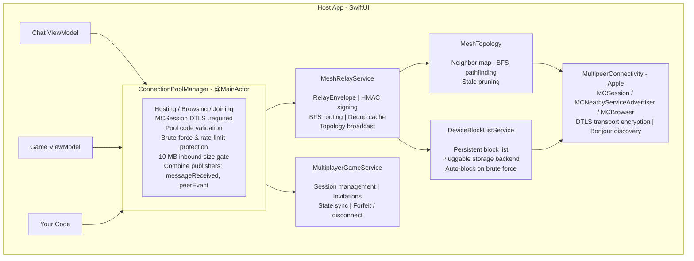
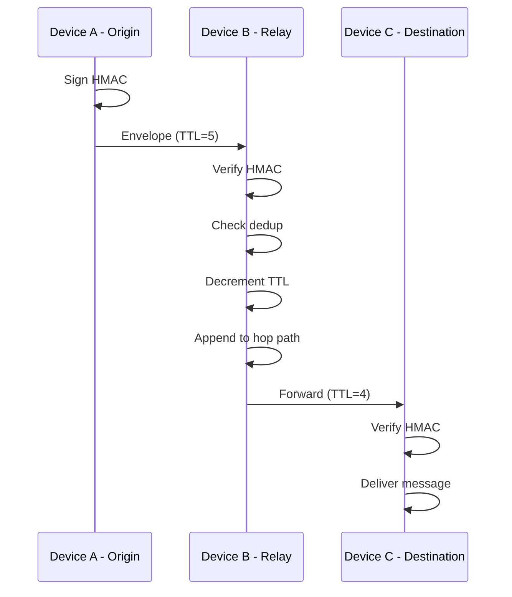
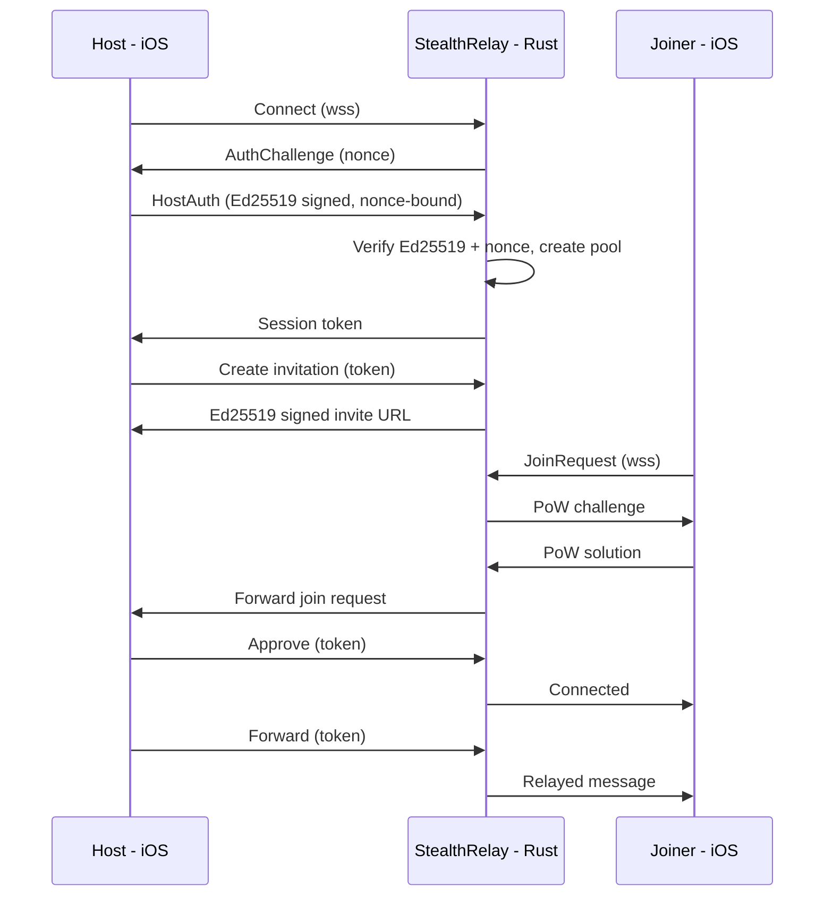

# Architecture

[Back to README](../README.md)

## Contents

- [Component Layout](#component-layout)
- [Mesh Message Flow](#mesh-message-flow)
- [Remote Relay Flow](#remote-relay-flow)

## Component Layout

## Mesh Message Flow

## Remote Relay Flow

## Related Documents

- [Security](Security.md) for the guarantees each layer enforces
- [API Reference](APIReference.md) for the types named above
